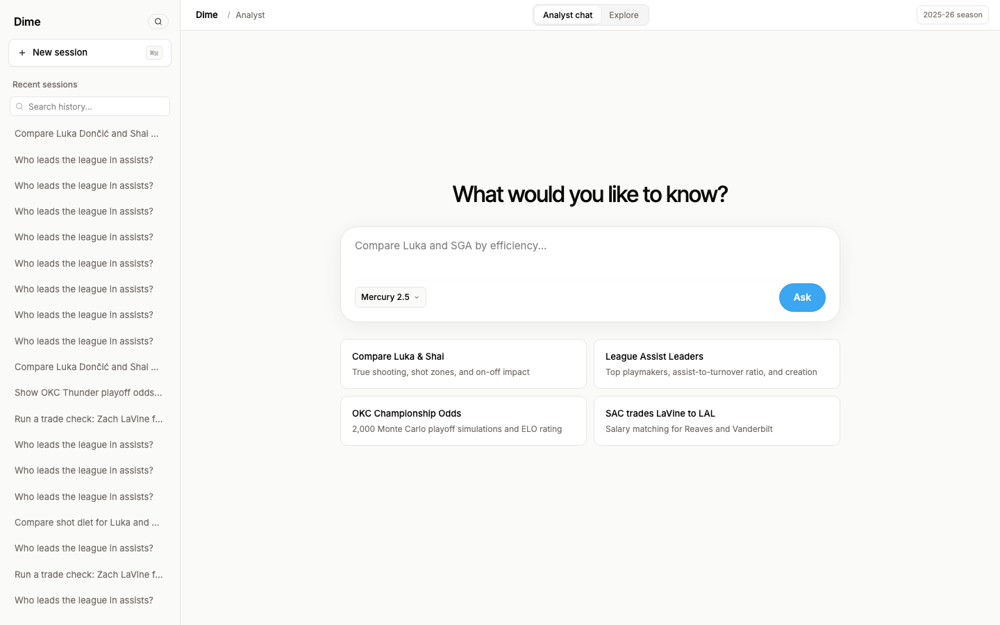
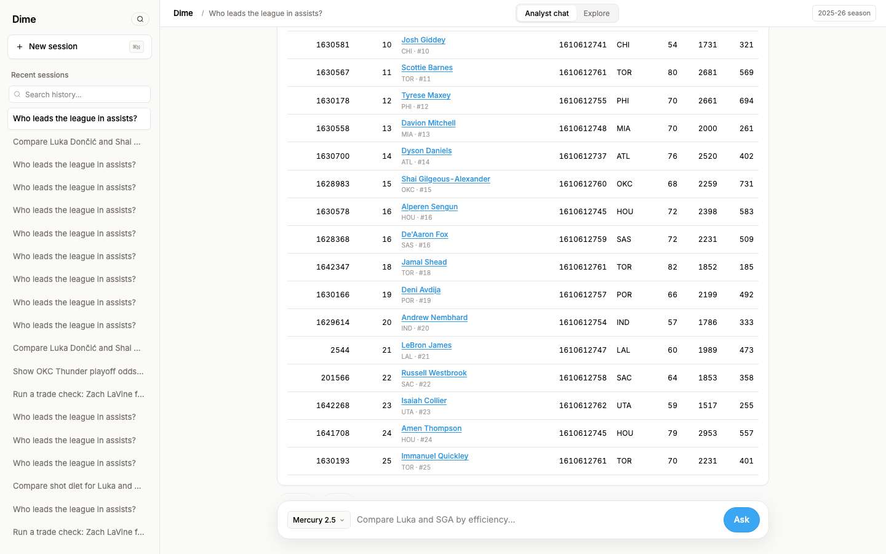
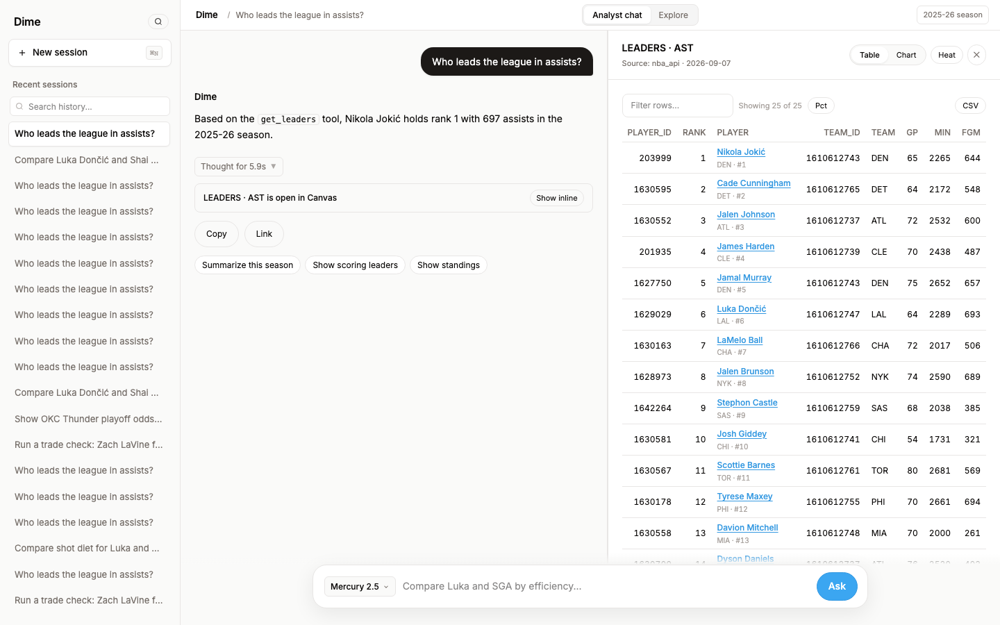

# Dime

Dime is a chat workbench for NBA questions. Ask in plain English. It queries a local DuckDB warehouse and live NBA APIs, then answers with tables that carry their source.



## Contents

- [What it does](#what-it-does)
- [Screenshots](#screenshots)
- [Tech stack](#tech-stack)
- [Prerequisites](#prerequisites)
- [Getting started](#getting-started)
- [Architecture](#architecture)
- [Environment variables](#environment-variables)
- [Testing](#testing)
- [Troubleshooting](#troubleshooting)

## What it does

The home screen offers four starter prompts. Each one runs end to end against live data.

- Player comparison with efficiency and shot data.
- League leaders with sortable tables.
- Playoff title odds from 2,000 Monte Carlo simulations plus ELO ratings.
- Trade legality checks against real salaries.



Every answer streams its reasoning steps. Tables open in a side canvas with table, chart, and court views plus CSV export.



## Screenshots

All three images above come from the running app. `docs/screenshots/home.png` shows the empty state. `docs/screenshots/chat-answer.png` shows a leaders query. `docs/screenshots/canvas.png` shows the side canvas.

## Tech stack

Backend lives in `backend/`. FastAPI serves the API. LangChain runs the agent graph. DuckDB stores 39 warehouse tables. A supervisor routes each question to one of three desks. The scout desk covers players. The team desk covers teams and lineups. The league desk covers standings, odds, drafts, and trades.

Frontend lives in `frontend/`. Next.js 16 renders the workbench. Tailwind v4 carries the Seline token set. The chat panel streams server-sent events. The canvas pane renders tables, charts, and an SVG half-court heatmap.

Model providers fall back in order. Inception Mercury serves first. Groq serves second. Mistral serves third.

## Prerequisites

- Python 3.13 with pip.
- Node 20 or newer with npm.
- One API key. `INCEPTION_API_KEY` works. `GROQ_API_KEY` works. `MISTRAL_API_KEY` works.

## Getting started

Start the backend.

```bash
cd backend
cp .env.example .env
pip install -r requirements.txt
uvicorn app.main:app --port 8001
```

The `.env` file stays local. It never commits.

Start the frontend in a second terminal.

```bash
cd frontend
npm install
npm run build
npm run start -- --port 3001
```

Open `http://127.0.0.1:3001`. The frontend talks to the backend through `NEXT_PUBLIC_BACKEND_URL`. It defaults to `http://localhost:8000`, so set it to `http://127.0.0.1:8001` in `frontend/.env.local` when ports differ.

Seed historical data once from `backend/`.

```bash
python -m scripts.seed_history
```

## Architecture

A question enters `POST /api/v1/chat/stream`. The supervisor in `backend/app/graph.py` triages it. Single-entity questions skip planning. Multi-entity trade questions route to the league desk. Comparisons call one composite tool.

Desks live in `backend/app/subagents.py`. Each desk owns a small tool subset and a call budget. Tool results stream back as events. The analytics node writes the final answer from evidence only. Numbers missing from evidence get flagged.

Tools live in `backend/app/tools/`. There are 49. Names start with `get_` plus `delegate_` plus `run_python`. `run_python` executes read-only Python over the warehouse. Imports, writes, and network calls stay blocked.

Warehouse tables use the `silver_` prefix. Game logs cover 2024-25 and 2025-26. Tools default to 2025-26 and accept any season the caller names. History tables reach further back for lineups, possessions, and RAPTOR values.

Datasets live behind `GET /api/v1/datasets/{name}`. The Explore tab reads leaders, standings, game logs, shots, lineups, playoffs, trades, and drafts from these endpoints. CSV export appends `?fmt=csv`.

## Environment variables

Backend reads `backend/.env`.

| Variable | Purpose |
| --- | --- |
| `INCEPTION_API_KEY` | First-choice model provider |
| `GROQ_API_KEY` | Fallback provider |
| `MISTRAL_API_KEY` | Last-resort provider |

Frontend reads `frontend/.env.local`.

| Variable | Purpose |
| --- | --- |
| `NEXT_PUBLIC_BACKEND_URL` | Backend base URL |

## Testing

Run these from `backend/`.

```bash
python3 -m pytest
python3 -m scripts.eval
python3 -m scripts.scenarios
```

Current counts: 12 unit tests, 51 eval checks, 17 scenario checks. All green.

Run the browser pass from anywhere with Playwright installed.

```bash
python3 /tmp/review/beta.py
```

It drives the real frontend. It checks the model picker, the leaders explorer, the shot chart, a chat answer, and session reset. Five checks. All green.

## Troubleshooting

The frontend shows a blank page. Rebuild the production bundle. `rm -rf .next` inside `frontend/`, then `npm run build`, then `npm run start -- --port 3001`. Verify against the production server. The dev server has a known hydration fault.

Only one frontend server can run at a time. Kill strays with `pkill -f "next-server"` before rebuilding. Building while a server runs corrupts `.next`.

Chat returns empty answers with `Tried:` listings. The backend needs a restart to pick up new code. `pkill -f "uvicorn app.main"` then start it again.

DuckDB reports a lock conflict. The warehouse allows one writer. Scripts that seed data cannot run while the backend holds the file. Stop the backend, seed, restart.

Live NBA endpoints throttle after heavy seeding. The warehouse fallback covers seeded entities. Unseeded live-only queries wait for cooldown.
