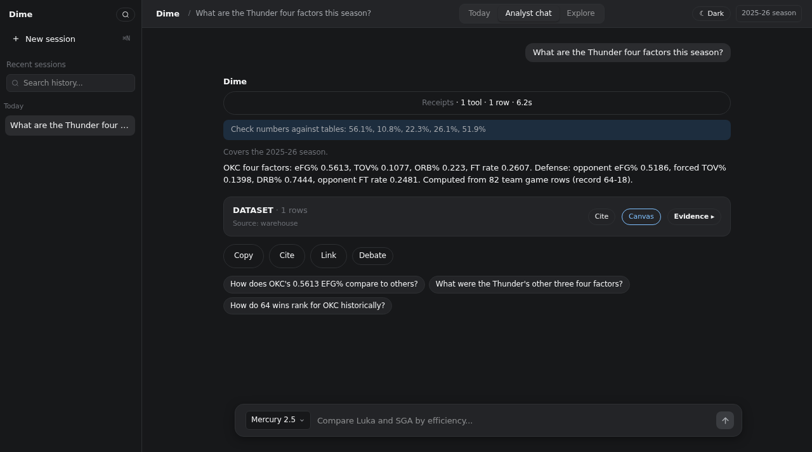
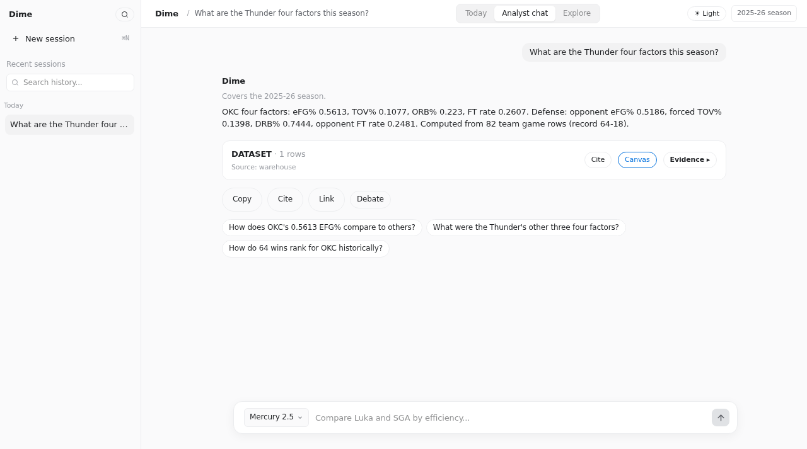

# Dime

Answers NBA questions with stats pulled from its own data warehouse.

You ask in plain English in a chat. Dime plans the query, runs it, and
shows its work: the tables, charts, and shot maps behind every number.



<video src="assets/readme/dime-motion-demo.mp4" controls muted loop playsinline width="100%"></video>

## Demo

Live at [dime-fawn.vercel.app](https://dime-fawn.vercel.app). Runs on $0 of
model spend.

## What you can ask

Current season (2025-26): scoring, efficiency, true shooting, four factors,
on/off splits, clutch numbers, shot zones, lineups, rest advantage, game
predictions. Player comparisons and head-to-heads. Trade checks against the
2026-27 cap ledger, award races, draft history back to 1996-97.

History: 17 seasons of game logs, shots, possessions, lineups, and
standings (2009-10 through 2025-26), play-by-play for 2020-21 through
2024-25, and FiveThirtyEight RAPTOR back to 1976-77.

If a question falls outside the data, the answer names the coverage window
instead of guessing.

## How it works

```
frontend/   Next.js 16, React 19, Tailwind 4, Recharts.
            Streams tokens and live tool activity; dark and light themes.
backend/    FastAPI planner with 94 tools over a local DuckDB warehouse
            (48 silver tables). Four free-tier LLM providers behind one
            interface: Mistral, OpenRouter, Inception, Groq.
infra/      Azure Container Apps, scale-to-zero.
```

Questions with one right answer (records, four factors, Finals results,
rankings) are answered by code reading the warehouse, not by the model
recalling numbers.

### Experimental Jev decision layer

Dime includes an optional TypeSafe Jev adapter for bounded decisions. Dime code
first resolves entities, seasons, data vintages, and prerequisites. It then
builds a finite candidate set. Jev can classify evidence, judge an eval result,
route a model request, or select one valid tool and its typed arguments.

Jev does not plan the analysis or verify factual claims. PydanticAI remains the
structured-output boundary, and Dime's deterministic checks decide what can be
published. An `unresolved` selection blocks the decision. API errors return
control to the existing path instead of executing a guessed call.

The adapter is experimental and disabled by default. It imports
`typesafe-sdk` only when an enabled caller constructs it, so the SDK and its
private package index are not required for a normal install.



## Data

Seeders in `backend/scripts/` pull from stats.nba.com, Basketball-Reference,
ESPN, and pbpstats into silver tables. Derived tables (team four factors,
RAPM-lite) are computed locally from those rows. The warehouse ships as a
release asset and is baked into the Docker image, so answers do not depend
on anyone's rate limits at query time.

## Quickstart

Backend (Python 3.12):

```bash
cd backend
uv venv --python 3.12
uv pip install -r requirements.txt
cp .env.example .env   # add your LLM keys
uvicorn app.main:app --port 8010
```

Frontend (Node 22):

```bash
cd frontend
npm install
NEXT_PUBLIC_BACKEND_URL=http://127.0.0.1:8010 npm run dev
```

Open http://localhost:3000 and ask: "What are the Thunder's four factors
this season?"

## Tests

The benchmark pack (`backend/tests/benchmark/`) runs 27 scenario chains
against a live backend with expected-answer assertions and latency budgets:

```bash
cd backend
python tests/benchmark/runner.py --url http://127.0.0.1:8010 --out reports/run.json
```

The pytest suite covers routing, the pinned lanes, warehouse contracts, and
streaming:

```bash
cd backend
pytest tests/ -q
```

## Deploy

`infra/deploy.sh` builds and pushes the backend image and updates the
Container App. Needs `az login` on the subscription and `backend/.env`
with the LLM keys, which are pushed as Container App secrets and never
committed.
