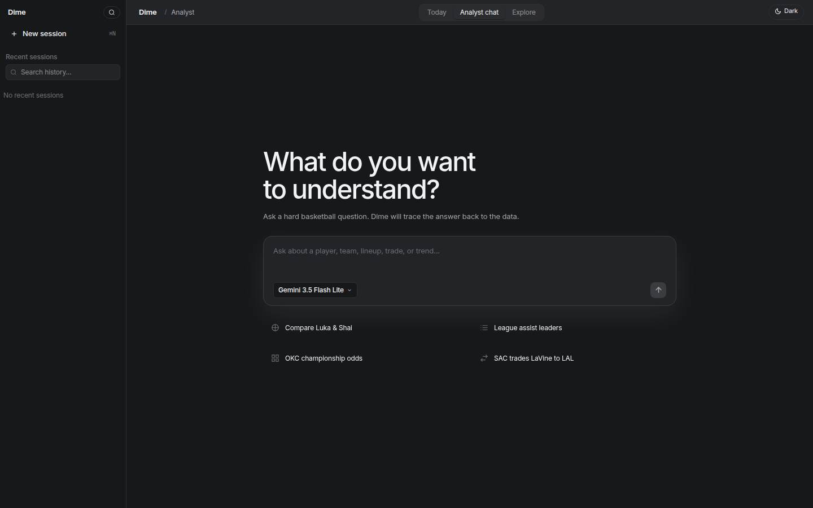
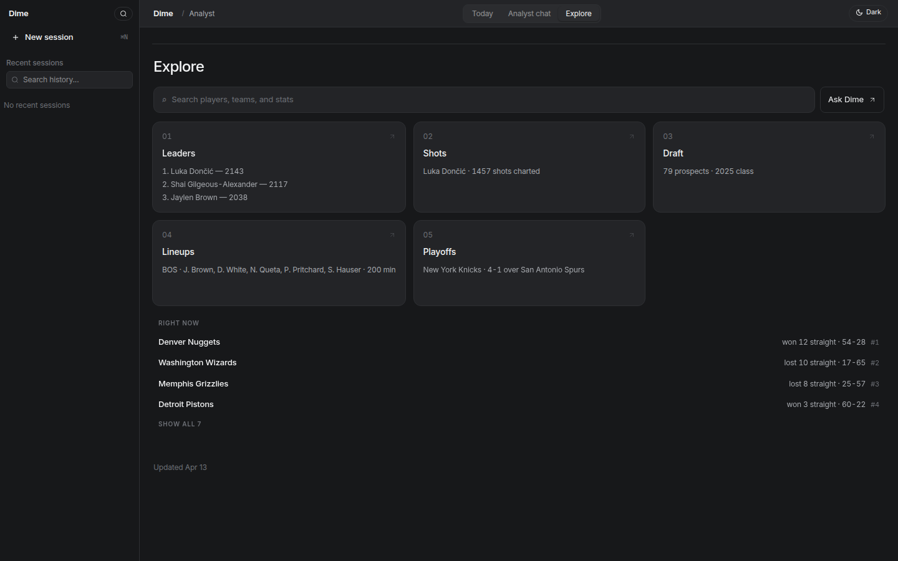
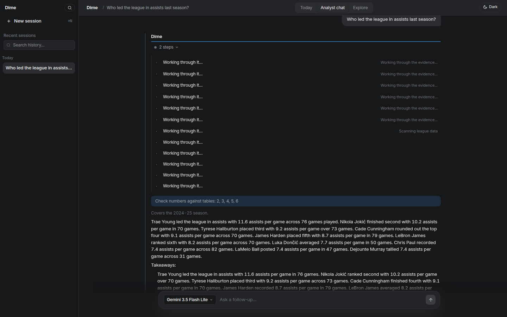
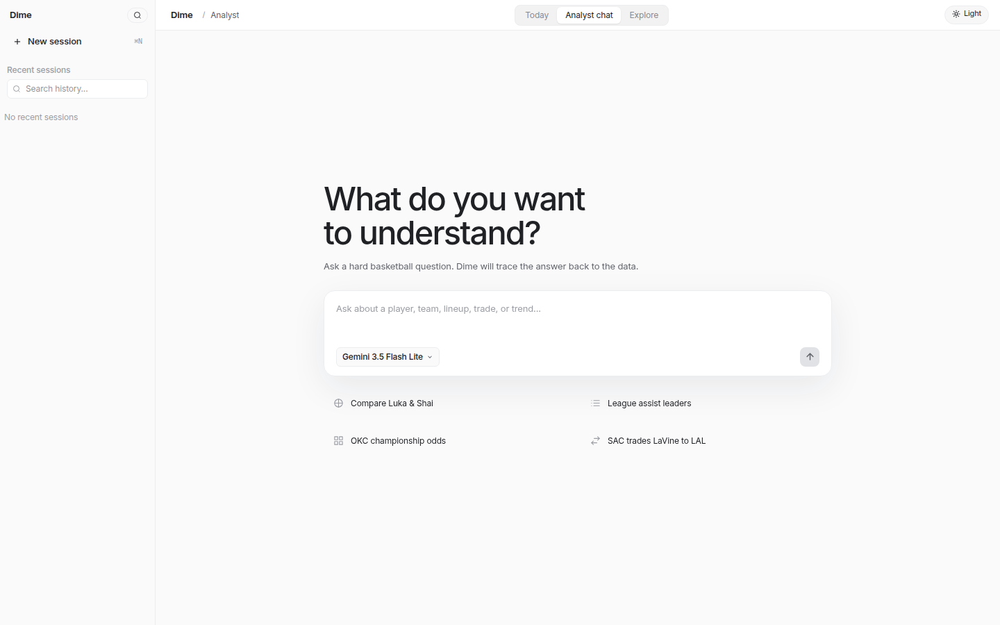

# Dime

Ask NBA questions in plain English. Dime plans the query, runs it
against its own data warehouse, and shows its work.

Live demo: [dime-fawn.vercel.app](https://dime-fawn.vercel.app)

<video src="assets/readme/dime-motion-demo.mp4" controls muted loop playsinline width="100%"></video>







## Features

- Chat that answers with numbers, not vibes. Every stat comes
  out of the warehouse and the reply shows the tables, charts,
  and shot maps behind it.
- Current season (2025-26): scoring, efficiency, true shooting,
  four factors, on/off splits, clutch numbers, shot zones,
  lineups, rest advantage, game predictions, head-to-heads.
  Trade checks against the 2026-27 cap ledger, award races,
  and draft history back to 1996-97.
- History: game logs, shots, possessions, lineups, and
  standings for 2009-10 through 2025-26, play-by-play for
  2020-21 through 2024-25, and RAPTOR back to 1976-77.
- Fixed answers come from code, not recall. Records, four
  factors, Finals results, and rankings are computed from
  warehouse rows. Outside the coverage window, the answer
  says so instead of guessing.
- 101 tools over a local DuckDB warehouse. Chat runs on
  Gemini (default) and NVIDIA NIM behind one interface.
- Streams tokens and live tool activity over SSE, in dark
  and light themes.



## Quickstart

Backend (Python 3.12):

```bash
# warehouse: fetch the data pack release (verifies checksum, unzips to backend/data/warehouse.duckdb)
./scripts/fetch-data.sh
cd backend
uv venv --python 3.12
uv pip install -r requirements.txt
cp .env.example .env   # add your LLM keys for chat; the server boots without them
python scripts/generate_asset_manifest.py manifest/expected_asset_manifest.json
DIME_EXPECTED_ASSET_MANIFEST=$PWD/manifest/expected_asset_manifest.json \
  uvicorn app.main:app --port 8010
```

The manifest step is required. Without
`DIME_EXPECTED_ASSET_MANIFEST`, the server exits at startup
with `RuntimeError: DIME_EXPECTED_ASSET_MANIFEST is required`.

Frontend:

```bash
cd frontend
npm install
NEXT_PUBLIC_BACKEND_URL=http://127.0.0.1:8010 npm run dev
```

Open http://localhost:3000 and ask: "What are the Thunder's
four factors this season?"

## How it works

```
frontend/   Next.js 16, React 19, Tailwind 4, Recharts.
            Streams tokens and live tool activity over SSE; dark and light themes.
backend/    FastAPI planner with 101 tools over a local DuckDB warehouse.
            Gemini (default) and NVIDIA NIM behind one interface.
infra/      Azure Container Apps, scale-to-zero.
```

You type a question. The planner picks the tools, runs them
against the warehouse, and streams back the answer with the
evidence attached.

Production serves the v1 runtime. The v2 runtime is built,
tested, and wired behind the `DIME_RUNTIME_V2` flag, with
the cutover still pending.

## Data

The warehouse is a DuckDB file baked into the backend Docker
image. On backend changes, CI downloads the data pack
(`dime-data-20260930`), unzips it into
`backend/data/`, builds derived tables at
image time, and pushes
`ghcr.io/mythiipanda/dime-backend:latest`. For local dev,
`./scripts/fetch-data.sh` fetches the current pack
(`dime-data-20260930`, checksum-verified) and exits 1 on
failure. The warehouse is the primary source at answer time; on misses, some datasets fall back to live sources (nba_stats, ESPN) where configured, and that fallback can fail or time out.

The current pack holds 54 tables. A fresh backfill covers
2015-16 through 2024-25 with 330,485 boxscore rows and 40,000
lineup rows. The pack also carries the historical tables:
RAPTOR, RAPM, shots, advanced stats, on/off splits, clutch
splits, leaders, salaries, zone splits, and the `hist_*`
tables.

## Evals and tests

The benchmark pack lives in the private dime-internal repo
at `evals/benchmark-pack/`. It runs 35 scenarios against a
live backend with expected-answer assertions. From a
dime-internal checkout:

```bash
python evals/benchmark-pack/runner.py --url http://127.0.0.1:8010 --out reports/run.json
```

The pytest suite (`backend/tests/`, 118 test files) covers
routing, the pinned lanes, warehouse contracts, and
streaming:

```bash
cd backend
pytest tests/ -q
```

## Contributing

Push backend changes on `dev` and CI builds the backend
image with the data pack baked in. Run `pytest tests/ -q`
from `backend/` before you open a PR. Deployments go
through `infra/deploy.sh`, which needs `az login` and the
LLM keys in `backend/.env` (pushed as Container App
secrets, never committed).

## License

No license file ships with the repo yet.
